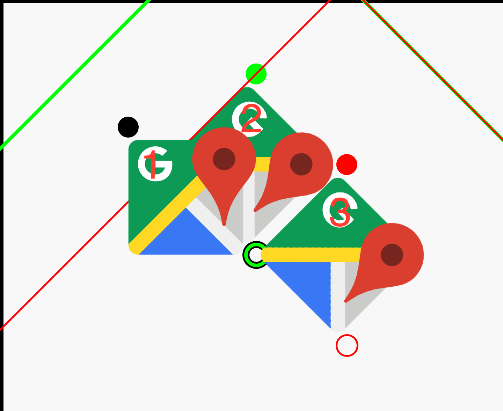
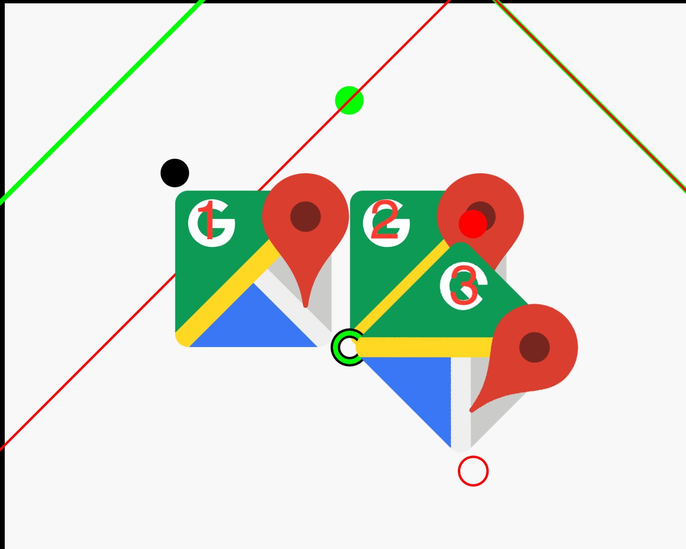

HenCoder 绘制 4 练习项目
===

### 这是什么？

这不是一个独立使用的项目，它是 [HenCoder Android 开发进阶：UI 1-4 绘制的辅助](http://hencoder.com/ui-1-4) 的配套练习项目。

### 怎么用？

项目是一个可以直接运行的 Android App 项目，项目运行后，在手机上打开是这样的：


工程下有一个 `/practice` 目录：


你要做的是就是，在 `/practice` 下的每一个 `PracticeXxxView.java` 文件中写代码，绘制出和页面上半部分相同的效果。例如写 `Practice01ClipRectView.java` 以绘制出经过平移的图形。就像这样：


> 当然，没必要做得和示例一毛一样。这是一个练习，而不是一个超级模仿秀，关键是把技能掌握。

如果做不出来，可以参考 `/sample` 目录下的代码：


练习做完，绘制第四期（绘制的辅助）的内容也就掌握得差不多了。

### 总结
视频中说 canvas 的几何变换方法是倒序的，这句话其实是不对的。
事实上，canvas 的几何变换方法针对的是坐标系。
例如，下面这段代码

```java
canvas.save();
canvas.rotate(45, right, bottom);
canvas.translate(width, 0);
canvas.drawBitmap(bitmap, left, top, paint);
canvas.restore();
```

实际上是先将坐标系以坐标(right, bottom)为中心，旋转45°后再将坐标系向右平移 width。
注意，向右平移是相对旋转后的坐标系来讲的。
如图，黑色表示原坐标系，绿色表示旋转后的坐标系，红色表示旋转加平移后的坐标系
实心点代表坐标(left, top)，空心点代表坐标(right, bottom)



1代表原图，2代表旋转坐标系后的图，3代表旋转加平移后的图

但是，对坐标系来进行几何变换往往不好理解，因为坐标系变了，代表着坐标的实际位置也变了，所以在 HenCoder 的视频中，
提出了一个相对比较好理解的概念，就是 canvas 的变换针对的是 bitmap，但是变换方法是倒序的，如下图



1同样代表原图,由于变换方法倒序，所以2代表平移后的图，3代表平移后再以(right, bottom)为中心旋转45°后的图

